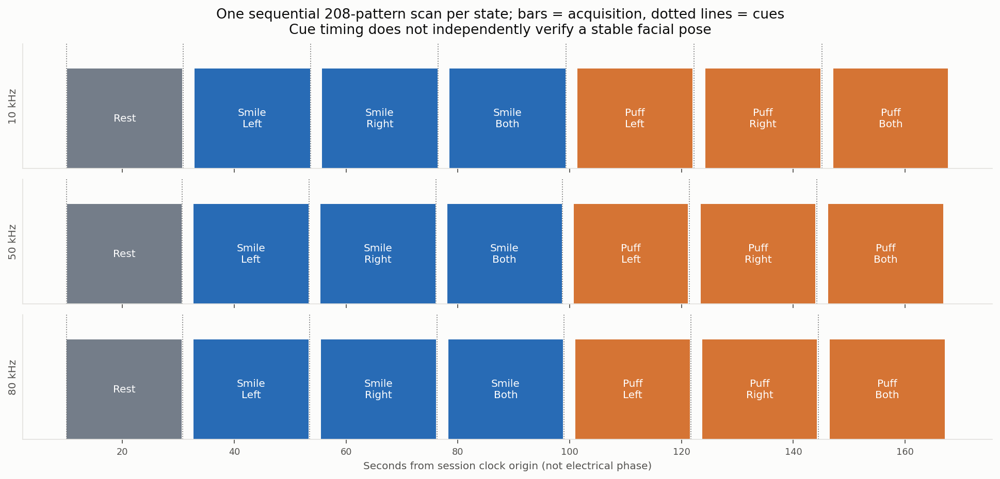
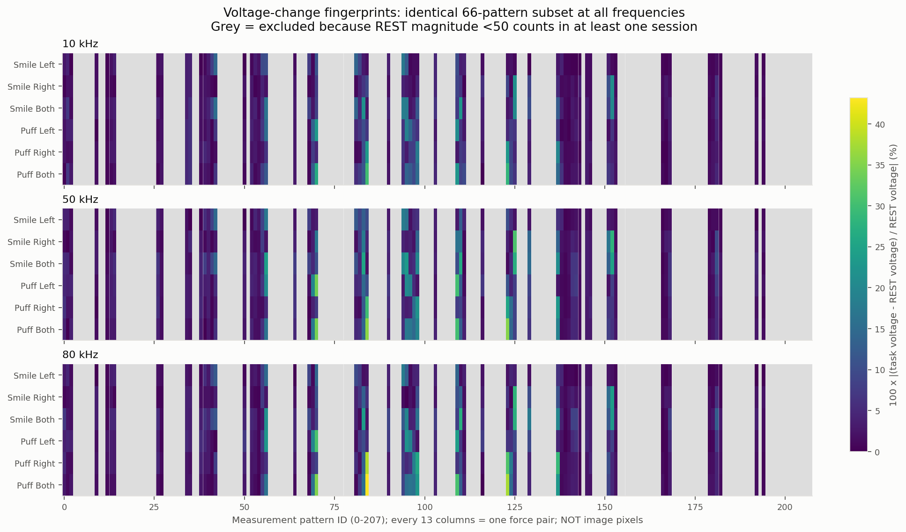
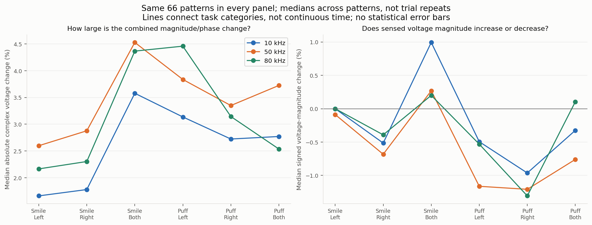
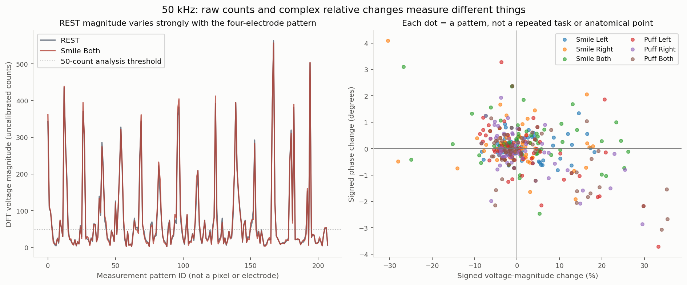
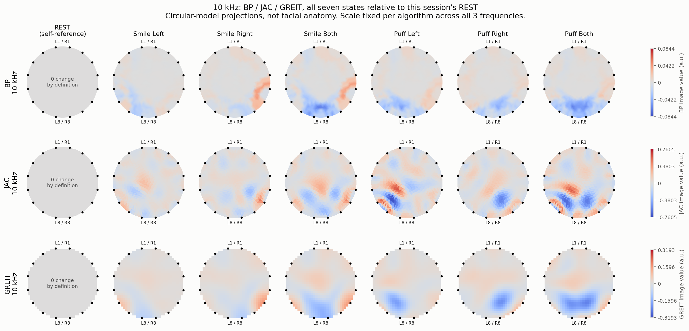
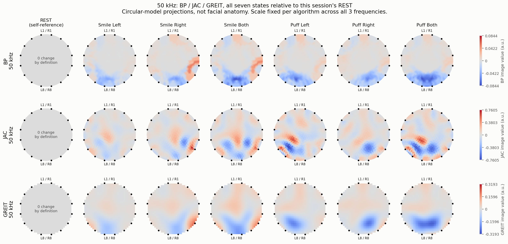
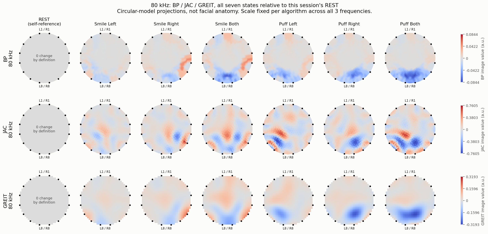
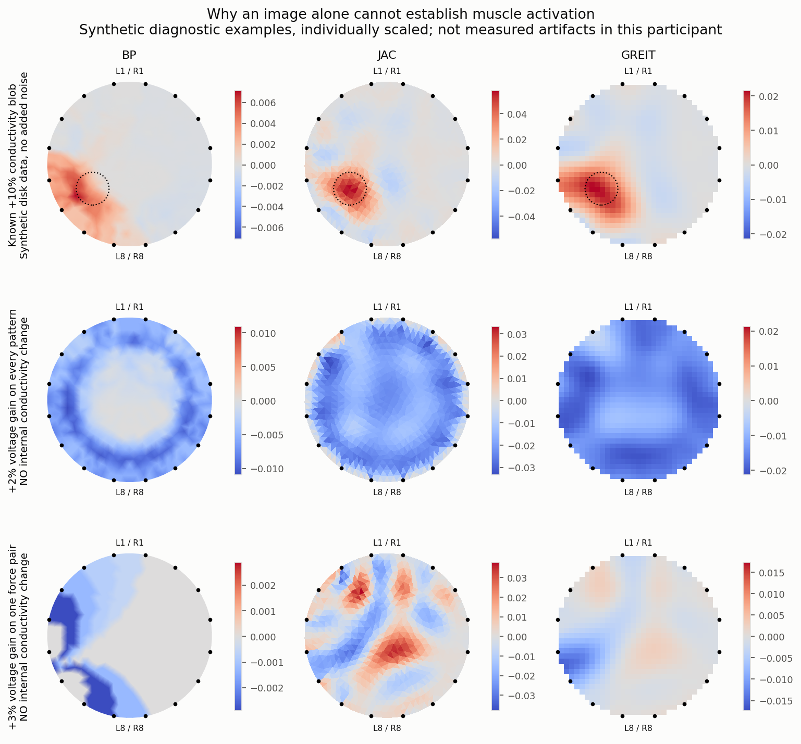

# What your facial recordings contain — and what EIT reconstruction can tell you

> **Archived analysis (2026-10-05).** Produced by a parallel session with `scripts/analysis/english_pilot_review.py`, now kept in `archive/2026-10-05-exploration/` together with its figures. The maintained, reproducible analysis is `python -m app study eit-measurement/data/studies/three-frequency-20261005.json` (see `eit-measurement/docs/pipeline.md`); its numbers match the Vietnamese report `2026-10-05-three-frequency-analysis.md`.

Analysis date: 2026-10-05. Based on the dated handoff
[`chatbot-handoff-2026-10-05-three-frequency-analysis.md`](../handoffs/2026-10-05-three-frequency-analysis.md)
and the three supplied live session folders. This English review supplements,
but does not overwrite, the preliminary Vietnamese report.

## 1. The answer first

Your recordings contain **complex sensed-voltage measurements for 208
four-electrode configurations**, at rest and during six cued facial tasks.
There are observable numerical differences between the recorded states.

**Yes: BP, JAC and GREIT can produce images from these differences.** I ran all
three at 10, 50 and 80 kHz for all seven states, including REST: **63 images**.
However, these are exploratory projections onto an assumed
circular model, **not validated pictures of your facial muscles**. The useful
result today is a set of voltage-change fingerprints; muscle localization and
muscle-activation percentages have not been established.

Keep three questions separate:

1. Did the recorded voltages change? **Yes, numerically.**
2. Were changes caused by the intended tasks, rather than drift, contact or
   other movement? **Plausible, but not isolated by this design.**
3. Which muscle changed, and by how much? **These recordings cannot establish that.**

## 2. What exactly is in a CSV row?

One row of `patterns.csv` means: “using this force pair, measure this sense
pair, at this frequency, within this host-recorded acquisition interval.”

| Field | Meaning | What it is not |
|---|---|---|
| `frame_id`, `trial_id`, `task` | Scan/trial identifiers and the cued state | Independent verification of the facial pose |
| `pattern_id` | Index 0–207 identifying a four-electrode configuration | A pixel or one facial muscle |
| `f_plus`, `f_minus` | Physical switch lines used for excitation | Two permanently assigned stimulation cups |
| `s_plus`, `s_minus` | Physical switch lines used for differential sensing | Two permanently assigned measurement cups |
| `*_site` | Recorded cup names, such as L1 or R8 | Measured 3D coordinates |
| `real_raw`, `imag_raw` | Real and imaginary components of the sensed-voltage DFT output | Calibrated volts, ohms, or EMG activity |
| `magnitude_raw`, `phase_deg` | Magnitude and angle calculated from those components | Two additional independent measurements |
| `start_s`, `end_s` | Host timing bounds for a measurement operation | Exact ADC integration timestamps or observed movement onset |
| `configured_frequency_hz`, `configured_amplitude_mvpp` | Recorded frequency and amplitude setting | Independent measurement of delivered voltage or current |

Write a complex measurement as `V = real_raw + i × imag_raw`. The two
components describe one oscillating voltage at the excitation frequency:
its magnitude and phase. **The imaginary component is not an imaginary or
unreal signal.** Negative real/imaginary counts describe the phase/sign
convention; they do not mean “this muscle has negative conductivity.”

The CN0565 documentation distinguishes forcing electrodes, sensed voltage,
and impedance measurement. Impedance requires a current reference as well as
voltage; this dataset records voltage-mode results, without a drive-current
column. [Analog Devices CN0565 circuit note](https://www.analog.com/en/resources/reference-designs/circuits-from-the-lab/cn0565.html).

### An actual example, not a hypothetical one

At **50 kHz, pattern 0**, the recorded roles are:

- Force: **L1 → L2**, physical **X0 → X2**.
- Sense: **L3 − L4**, physical **X4 − X6**.
- REST: `V0 = −108 + 326i` counts.
- SMILE_BOTH: `V1 = −113 + 343i` counts.
- Difference: `ΔV = −5 + 17i` counts.

This configuration samples a distributed electrical pathway. It is **not a
measurement of the L3 muscle**, even though L3 participates in sensing.

### Which sites do the recordings describe?

The following is the **recorded metadata**, not a new placement recommendation
or confirmation of anatomical localization. Coordinates are marked
`PROVISIONAL_NOT_MEASURED`.

| Site pair | Recorded skin landmark | Left X line / P1 pin | Right X line / P1 pin |
|---|---|---|---|
| L1 / R1 | Lateral forehead | X0 / 3 | X1 / 4 |
| L2 / R2 | Temple | X2 / 5 | X3 / 6 |
| L3 / R3 | Preauricular skin | X4 / 7 | X5 / 8 |
| L4 / R4 | Postauricular skin | X6 / 9 | X7 / 10 |
| L5 / R5 | Temporomandibular joint skin landmark | X8 / 11 | X9 / 12 |
| L6 / R6 | Below mandibular angle | X10 / 13 | X11 / 14 |
| L7 / R7 | Mid inferior jaw border | X12 / 17 | X13 / 18 |
| L8 / R8 | Anterior inferior jaw border | X14 / 19 | X15 / 20 |

Physical wiring is interleaved `L1,R1,L2,R2,…,L8,R8`. The software protocol
reorders these into `L1,…,L8,R8,…,R1`. Do not apply the older proposed mapping
to these files. The ear/TMJ portion is not a measured circular perimeter.

## 3. How much data did you collect, and when?

Each session contains REST, SMILE_LEFT, SMILE_RIGHT, SMILE_BOTH, PUFF_LEFT,
PUFF_RIGHT and PUFF_BOTH, **one complete scan per state**.

| Frequency | Complete scans | Complex readings | Median scan duration | Median REST magnitude | REST patterns ≥50 counts |
|---|---:|---:|---:|---:|---:|
| 10 kHz | 7 | 1,456 | 20.643 s | 26.92 counts | 73 |
| 50 kHz | 7 | 1,456 | 20.495 s | 31.16 counts | 82 |
| 80 kHz | 7 | 1,456 | 20.563 s | 30.56 counts | 73 |

Total: **21 scans, 4,368 complex readings**, including three REST scans and
18 task-labelled scans. The 208 values in a scan are different measurement
configurations, **not 208 repetitions of the task**.



**Read this figure:** a colored bar is a complete scan; a dotted line is a
software cue. Task scans start after approximately 2.014–2.033 s of settling.
All 21 scans fit inside their recorded cue windows. The task cue windows last
22.65–22.89 s, including settling, scanning and software overhead. The initial
REST starts almost immediately after its cue, not after a two-second settle.

**Important:** the 208 readings are acquired sequentially over
20.442–20.699 s. The reconstruction treats them as one stable state; that is
an assumption about your hold, not an instantaneous photograph. You cannot
slice a five-second segment of this recording and expect a complete
208-pattern frame. You also do not have a time course of muscle onset and
recovery from one scan per state.

Session 1 contains operator-reported trial windows. Sessions 2 and 3 do not.
Until confirmed, the analysis retains `cue_assumed` labels for all comparisons;
no new operator-confirmed windows were created. Software timing establishes
when a measurement operation occurred, not whether your pose stayed stable.

The final task is measured approximately **136–137 s after the REST scan
midpoint**. There is no intervening REST or recovery measurement.

## 4. What should you subtract, and what does the result mean?

First compute the complex difference for the **same pattern**:

`ΔV[k] = Vtask[k] − Vrest[k]`.

For comparison within each session, also compute:

`rV[k] = (Vtask[k] − Vrest[k]) / Vrest[k]`.

Call this **relative complex voltage change**, not measured `ΔZ`.
`100 × |rV|` describes the size of the combined magnitude/phase change.
Two easier-to-interpret quantities are:

- Signed magnitude change: `100 × (|Vtask| / |Vrest| − 1)` percent.
- Phase change: `angle(Vtask / Vrest)` in degrees, wrapped to −180°…180°.

For the actual pattern-0 example above:

- `rV = 0.0515686 − 0.00174665i`.
- Absolute complex change: **5.160%**.
- Sensed-voltage magnitude increased **5.157%**.
- Sensed-voltage phase changed **−0.095°**.

This means that **this sensed voltage changed**. It does not mean the facial
muscles activated by 5.16%, or that conductivity at L3 changed by 5.16%.

### Why voltage change is not automatically impedance change

For a four-electrode configuration, transfer impedance is
`Ztransfer = Vsense / Idrive`. Ignoring fixed instrument gain:

`Vtask / Vrest = (Itask / Irest) × (Ztask / Zrest)`.

Only with a stable or measured current reference can the voltage ratio be
interpreted as that impedance ratio. A fixed voltage command does not prove
fixed current when the load or contact changes.

The ratio removes a **fixed** complex instrument gain or polarity between
REST and TASK for a particular pattern. It does not remove gain/current that
changes during the task. Nor does it remove anatomy from the problem:
the existing anatomy still determines where the measurement is sensitive.

Conceptually, the observed difference may contain:

`Δmeasurement ≈ tissue-change effect + geometry-change effect + contact-change effect + drive-current change + drift/noise`.

Baseline subtraction cannot label these contributions separately. Published
EIT work demonstrates that changing electrode contact impedance and motion
can generate boundary artifacts, and models contact changes explicitly.
This supports treating contact as a possible confound; it does **not** show
that contact dominates your particular recordings.
[Boverman et al., simultaneous image/contact reconstruction](https://pubmed.ncbi.nlm.nih.gov/27295649/).

## 5. What do the new charts show?

### A. The voltage-change fingerprint



Each row is a task-labelled scan; each column is one measurement pattern.
Brighter colors mean larger `100 × |rV|`, **not higher conductivity**. A bright
column identifies a responsive four-electrode configuration, not a location
inside the face. Grey columns are excluded from this comparative view.

Why exclude some columns? Dividing by a small REST value magnifies the same
absolute error. A one-count change relative to 10 counts is 10%; relative to
100 counts it is 1%. The handoff's **50-count threshold is an analysis choice,
not a proven hardware noise cutoff**. Only 66 patterns meet this threshold
in all three sessions. These figures compare that identical subset so that
frequency comparisons do not also change the selected patterns.

All 208 patterns remain in the exported data. I also calculated results at
the 100-count threshold; these give different percentages, so conclusions
must disclose their selection rule. Excluded patterns are not proven useless.

### B. How much did each recorded state change?



The left panel uses the size of the complex change, which cannot be negative.
The right panel shows the signed magnitude change, which can increase or
decrease. Changes at different patterns can have opposite signs; a small
signed median therefore does not imply that nothing changed.

Median `100 × |rV|`, using the **same 66 patterns**:

| Cued task | 10 kHz | 50 kHz | 80 kHz |
|---|---:|---:|---:|
| Smile Left | 1.66% | 2.60% | 2.16% |
| Smile Right | 1.78% | 2.88% | 2.30% |
| Smile Both | 3.58% | 4.53% | 4.37% |
| Puff Left | 3.14% | 3.84% | 4.46% |
| Puff Right | 2.72% | 3.35% | 3.14% |
| Puff Both | 2.77% | 3.73% | 2.54% |

Observations, not causal conclusions:

- Smile Both has a larger median change than either unilateral smile at
  each frequency.
- Puff Both does **not** consistently exceed the unilateral puffs; combined
  tasks are not necessarily additive electrical measurements.
- The same-task fingerprints across frequency sessions correlate
  **0.841–0.983**, calculated over the concatenated real/imaginary relative
  changes on these 66 patterns. This is descriptive similarity, not a test
  of repeatability under an identical measurement condition.
- These sessions cannot establish an optimal physiological frequency:
  frequency changes together with session time, possible effort and drift.

If you instead use each session's own ≥50-count subset (73/82/73 patterns),
the handoff's Smile Both values are reproduced: **3.65%, 5.05%, 4.46%**.
The difference from the table above comes from the selected patterns, not a
disagreement about the raw measurements.

### C. Raw magnitude versus magnitude/phase change



On the left, REST and Smile Both look almost superimposed because the large
baseline structure depends on the configuration. Relative-change plots make
their smaller differences visible. Peaks in this plot are not high-activity
muscles.

On the right, each dot is one selected pattern for a task. Horizontal
position gives the exact signed magnitude change; vertical position gives
the phase change. This shows why magnitude alone does not contain the entire
complex response. Neither coordinate is a muscle activation percentage.

## 6. Can BP, JAC and GREIT reconstruct these recordings?

### Technically yes; anatomically not yet

All 21 recorded sequences match their metadata, and the logical protocol
matches the installed pyEIT 16-electrode adjacent protocol. This is a
**format/order compatibility check**, not proof that a disk represents the face.
pyEIT supplies BP, Jacobian-based and GREIT reconstruction implementations.
[Official pyEIT repository](https://github.com/eitcom/pyEIT).

### All three algorithms, all three frequencies, all seven states

Columns are **REST, Smile Left, Smile Right, Smile Both, Puff Left, Puff Right,
Puff Both**. Each frequency figure has three rows: BP, JAC and GREIT.







To compare frequencies directly within one algorithm, open:

- [BP: 10 / 50 / 80 kHz, seven states](../../archive/2026-10-05-exploration/data/processed/pilot/english-review-20261005/07_BP_three_frequencies_7states.png).
- [JAC: 10 / 50 / 80 kHz, seven states](../../archive/2026-10-05-exploration/data/processed/pilot/english-review-20261005/08_JAC_three_frequencies_7states.png).
- [GREIT: 10 / 50 / 80 kHz, seven states](../../archive/2026-10-05-exploration/data/processed/pilot/english-review-20261005/09_GREIT_three_frequencies_7states.png).
- [All 63 images in one overview](../../archive/2026-10-05-exploration/data/processed/pilot/english-review-20261005/10_all_algorithms_frequencies_7states.png).

These use the same mesh, solver parameters and 66 measurement configurations
at every frequency, reconstructing the real component of their relative
changes. Each state is compared with **REST from its own frequency session**;
the 50-kHz REST is not used as the reference for 10 or 80 kHz. Excluded configurations are
removed from the forward/inverse protocol, **not filled with zero change**.

### Why is every REST panel grey?

These are **difference reconstructions**, not absolute conductivity images:

`rV_REST = (Vrest − Vrest) / Vrest = 0`.

All three linear reconstruction algorithms therefore return zero for REST
against itself. The REST images are calculated through the same pipeline as
the tasks, not inserted as missing-data placeholders. This zero does **not**
mean your face has no conductivity, no resting muscle activity or no noise.
The raw REST voltage vector is nonzero and still contains its anatomy/contact/
instrument response. To observe REST variability you need another independently
recorded REST frame; these sessions contain only one each. An absolute anatomical
REST image would require a different, calibrated and validated reconstruction
workflow, not subtraction of REST from itself.

The recorded counts are not simply relabeled as volts. The pipeline is:

1. Calculate measured `rV` pattern by pattern.
2. Build an assumed homogeneous unit disk and compute its baseline model
   voltage vector, `Vmodel`.
3. Construct surrogate model input `Vsurrogate = Vmodel × (1 + Re(rV))`.
4. Apply each solver's normalized difference reconstruction to this input.
5. Plot the resulting model-dependent values, in arbitrary units.

Step 3 puts the fractional measured changes into a model-compatible sign/
scale convention. **It is not a voltage calibration**, does not resolve
current variation, and discards the imaginary relative-change component.

| Algorithm | Simple explanation | How to read this output |
|---|---|---|
| BP | Spreads each measurement difference through a model-based sensitivity region | Broad/smeared node image; inexpensive but not precise localization |
| JAC | Uses a Jacobian: how each triangle's conductivity would change the measurements; regularization limits unstable solutions | Element image with more structure; apparent sharpness is not proof of correctness |
| GREIT | Builds a linear measurement-to-grid map using the model and desired spatial response | Smooth 32×32 display grid; additional pixels do not add measured information |

**Color:** red is a positive image value, interpreted as increased conductivity
only under the assumed model and excitation convention; blue is negative.
Neither proves a real tissue conductivity increase/decrease. Every algorithm
has **one common scale across all 21 frequency/state panels**, but scales differ between
algorithms. Do not compare their red intensities as equal physical changes.
Participant-left is drawn on the left; this is not a mirrored photograph.

The symmetric display limits are BP **±0.08440**, JAC **±0.76052**, and GREIT
**±0.31927**, in algorithm-specific arbitrary units. A panel is not independently
rescaled to make its own largest response look equally strong. This preserves
amplitude comparisons **within** an algorithm across frequency sessions, although
frequency remains confounded with session/effort/drift in the experiment.

JAC and GREIT share some lower-region structure, while BP spreads it more
broadly. Several tasks have a similar lower-region negative component. That
is an observation about these projections, **not evidence of a shared weak
muscle**. Agreement between algorithms using the same incorrect model would
not independently validate the location.

### What assumptions and parameters generated these images?

- Disk radius `R=1`: dimensionless, not 1 cm. Background relative conductivity
  `σ=1`: a normalization, not a claim that the face is saline or homogeneous.
- Sixteen equally spaced point electrodes at the recorded logical order.
  Real positions, sizes, skin contacts, skull, fat, air spaces and 3D pathways
  are **not** represented.
- Mesh spacing `h0=0.08`: approximately 8% of the model radius, controlling
  numerical discretization rather than electrode count. This run generated
  **586 nodes and 1,090 triangular elements**; these are algorithm-generated
  model quantities, not measured tissue structures. A node is a triangle
  vertex; an element is a triangle.
- BP: `weight="none"`. Its pyEIT 1.2.4 normalization is sign-only, unlike
  the magnitude normalization in JAC/GREIT. All use the same measured ratios,
  but do not have identical numerical scaling.
- JAC: Kotre regularization, `p=0.5`, `lambda=0.01`, normalized Jacobian.
  `p` shapes the diagonal regularization weighting; `lambda` balances model
  fitting against stabilization.
- GREIT: `p=0.5`, `lambda=0.01`, `n=32`, `s=20`, `ratio=0.1`, normalized
  Jacobian. In this implementation `p` shapes regularization in measurement
  space; `s` and `ratio` control spatial interpolation weights. `n` controls
  display sampling, not anatomical resolution.

These settings follow the existing simulation sandbox as engineering
examples. They were **not optimized or validated for facial data**. The exact
parameters, selected pattern IDs and image arrays are saved alongside the
figures. The new standard-solver images are not numerically identical to the
earlier report's custom noise-weighted JAC images.

The linear inverses approximate small changes around their model baseline.
Some measured pattern changes are much larger than the median; this adds a
further reason not to interpret image amplitudes as quantitative tissue
conductivity. Small-change validity must be checked against forward predictions
and validation data, not assumed from the appearance of an image.

### A diagnostic demonstration: an image is not proof of its cause



The top row uses a known simulated +10% conductivity object: center
`(−0.45,−0.30)`, radius `0.20R`. The dotted circle is its true position.
JAC/GREIT positive peaks lie near it; BP is more spread toward the boundary.
This checks implementation/sign consistency in the same disk model, not
hardware performance or facial localization.

The next two rows contain **no internal conductivity change**. I changed
only the simulated measured-voltage gain: +2% globally or +3% on one force
pair. All three algorithms still generate colored images. Thus a plausible
image can have a non-tissue explanation. These are hypothetical diagnostic
examples, **not a claim that your measured response was caused by those gains**.
Each control image is individually scaled; their colors do not compare size
across rows.

Your existing placement does not have to be a perfect circular ring for EIT
in principle. But using noncircular 3D placement requires a corresponding
forward model and actual electrode coordinates. Relabeling a disk's points
with facial cup names does not turn the disk into a facial model.

## 7. Which earlier interpretations should not be carried forward?

1. **“Relative ΔZ”** → call it relative voltage change unless drive current
   or calibrated transfer impedance is available.
2. **“Above measured noise”** → not established here. The handoff references
   a separate REST-only recording at command amplitude 800, but that folder
   is absent from this checkout and does not match these 600-command sessions.
   One REST per frequency cannot estimate same-condition variability.
3. **“100% recognition accuracy”** → the earlier 18/18 exploratory classifier
   cannot establish generalization. Every session uses the same task order;
   task label and sequence position are perfectly confounded. A classifier
   using only position would also label all frames correctly. A small
   permutation p-value does not fix that experimental-design problem.
4. **“Raw reciprocity mismatch proves a fault”** → transfer-impedance
   reciprocity concerns `V/I`, not raw voltages driven by potentially different
   currents. A fitted drive-gain factor is not a measured current.
5. **“Measured changes exceed one simulated blob, therefore contact dominates”**
   → invalid causal inference. One chosen object size/contrast is not a bound
   on all possible tissue changes. The present data cannot identify the
   dominant source without additional controls.
6. **“Left/right-sensitive patterns prove localization”** → they are
   distributed configurations, measured at different times. In the supplied
   protocol, left-only and right-only configurations are separated by roughly
   11 seconds within the scan. Temporal change can therefore mimic asymmetry.

## 8. What evidence would make the next conclusion stronger?

For task-recognition feasibility, the immediate missing evidence is not a
prettier image. It is **repeated, time-controlled comparisons**:

- Same-frequency repeated trials, with randomized task order.
- A local pre-task REST and a post-task REST to test recovery.
- REST-only controls using the same timing/settings to estimate per-pattern
  variability and drift.
- Synchronized video/cue records, plus documented lead/contact disturbances.
- Held-out sessions and electrode reapplication before claiming robust task
  recognition; more participants before population-level claims.

For spatial or muscle-specific EIT, additionally require validated drive/
sense calibration, current reference or equivalent validated excitation
model, known-target hardware validation, actual electrode coordinates, an
appropriate 3D geometry/contact model, and tests distinguishing tissue
changes from motion/contact. Clinical muscle weakness requires further
independent physiological/clinical validation. Analysis of these recordings
does not establish electrical safety for future human measurements.

## 9. A defensible summary for your professor

> We collected 16-electrode, 208-pattern voltage scans at rest and during six
> cued facial tasks at 10, 50 and 80 kHz. On an identical 66-pattern subset,
> median complex relative-voltage changes ranged from 1.66% to 4.53%.
> The recordings show structured changes associated with the labelled states.
> BP, JAC and GREIT produce exploratory images at all three frequencies and
> seven states under a circular forward model, with REST versus itself identically zero,
> but these are not validated anatomical or muscle-activation maps. The current
> pilot cannot separate task effects from drift, contact, geometry or current
> changes; randomized repeated rest–task–rest trials and spatial-model validation
> are the next evidential steps.

## 10. Outputs and reproducibility

The new script is
[`scripts/analysis/english_pilot_review.py`](../../archive/2026-10-05-exploration/scripts/analysis/english_pilot_review.py).
Historical commands (the script and its test now live in `archive/2026-10-05-exploration/`; to run them again,
copy them back as described in that folder's README):

```sh
.venv-sim/bin/python archive/2026-10-05-exploration/scripts/analysis/english_pilot_review.py
.venv-sim/bin/python -m unittest discover -s archive/2026-10-05-exploration/tests -v
```

It writes only to
[`archive/2026-10-05-exploration/data/processed/pilot/english-review-20261005/`](../../archive/2026-10-05-exploration/data/processed/pilot/english-review-20261005/):

- Twelve English figures, embedded or linked above, including seven
  reconstruction comparison layouts displaying all 63 frequency/state/algorithm
  images and a separate synthetic diagnostic figure.
- `pattern_voltage_changes.csv`: all 3,744 task-minus-REST pattern comparisons,
  with counts, exact magnitude/phase changes and the selection flag.
- `task_features.csv`, `qc_summary.csv`, `timeline.csv` and the recorded cup map.
- `cross_frequency_fingerprint_correlations.csv`: descriptive comparisons.
- `exploratory_images.npz`: node/element data, selected IDs, GREIT grid/mask and
  all 63 image arrays. Explicit keys use `<frequency>Hz_<STATE>_<ALGORITHM>`,
  for example `10000Hz_REST_BP` or `80000Hz_PUFF_BOTH_GREIT`. Legacy unprefixed
  task keys still denote 50 kHz for compatibility. Arrays use native node,
  triangle or flattened-grid sampling, not a common pixel representation.
- `summary.json`: checks, parameters and numerical provenance.
- `raw_sha256.json`: original raw-file hashes; verified unchanged after analysis.

Every frame was checked for all 208 IDs, force/sense ordering, site-name
mapping, timing bounds, finite counts and stable recorded settings. All checks
passed. **File consistency is not hardware calibration or physiological validation.**
All 23 software tests passed, including six additional tests for three-frequency/
seven-state coverage, frequency-specific references, zero REST, pattern exclusion
and shared color scales. All 63 real-data projections are finite; all nine REST
self-reference images are exactly zero.
Raw files, trial labels and the preliminary report were preserved.
