# Phân tích 3 phiên 10 / 50 / 80 kHz (2026-10-05) — dữ liệu có gì, và có reconstruct ảnh được không

Nguồn: [handoff 2026-10-05](../handoffs/2026-10-05-three-frequency-analysis.md). Mọi số liệu và hình được
tạo lại bằng pipeline `app.eit` (quy trình đầy đủ: [eit-measurement/docs/pipeline.md](../../eit-measurement/docs/pipeline.md)):

```bash
.venv-sim/bin/python -m app study eit-measurement/data/studies/three-frequency-20261005.json
```

Output: [`eit-measurement/data/results/three-frequency-20261005/`](../../eit-measurement/data/results/three-frequency-20261005/), gồm
`tables/` (CSV), `figures/` (hình báo cáo), `slides/`, `clean/`, `manifest.json` (git commit, phiên bản thư viện,
SHA-256 của dữ liệu thô) và `README.md` (tóm tắt tự động). Dữ liệu thô nằm ở `eit-measurement/data/sessions/` và chỉ được đọc.
Các con số chính (danh sách trong `eit-measurement/backend/tests/fixtures/three_frequency_20261005_expected.json`: QC, đặc trưng task,
lateralization, tương quan, additivity, F8, nhận dạng, metric ảnh) được kiểm tra tự động bằng
`eit-measurement/backend/tests/test_regression.py`. Các con số khác trong báo cáo lấy trực tiếp từ bảng trong `tables/`.

> **Status:** exploratory single-subject pilot. Label task là `cue_assumed` (không có video/EMG).
> Mọi số liệu dưới đây được tính từ file; diễn giải nào cũng kèm giới hạn.

---

## 0. Tóm tắt

**Dữ liệu có gì?** Mỗi phiên gồm 7 frame (REST + 6 task). Mỗi frame có 208 số phức: đó là điện áp
4 điện cực (4-electrode transfer voltage) đo **tuần tự** trong khoảng 20.6 s, ở dạng count DFT chưa
hiệu chuẩn. Khoảng 60% pattern (126–135/208) quá yếu (|V| < 50 count), gần mức nhiễu. Thông tin hữu ích
tập trung ở 73–82 pattern mạnh.

Những điểm có thể nói một cách trung thực:

1. Thay đổi khi làm task **lớn hơn mức nền REST→REST đã đo**. Tính trên pattern ≥ 100 count (cùng
   ngưỡng với mức nền), trung vị là 1.2–4.5% so với nền 0.36–0.96%. Trường hợp yếu nhất,
   SMILE_RIGHT ở 10 kHz (1.20%), chỉ hơn nền một chút.
2. Hình dạng thay đổi theo từng task **lặp lại rất tốt giữa 3 phiên**: r = 0.84–0.98, so với
   r trung bình 0.02–0.58 giữa các task khác nhau. Nearest-centroid leave-one-session-out đoán đúng
   18/18 frame. Tuy nhiên kết quả này bị confound vì **thứ tự task giống hệt nhau** ở cả 3 phiên.
3. Task trái và phải cho **pattern khác nhau, không tương quan** (SMILE_LEFT~SMILE_RIGHT
   r ≈ 0.0–0.2), dù hai task này chỉ cách nhau 23 s. Task hai bên ≈ tổng của hai task một bên
   (R² = 0.77–0.95).
4. Thay đổi chủ yếu nằm ở **biên độ** (Re), còn pha gần như không đổi (≤ 0.16° trung vị).

**Có dùng được image reconstruction không?** Về mặt kỹ thuật thì **có**. Sequence của board khớp
chính xác 208/208 hàng với `pyeit.eit.protocol.create(16, 1, 1, "std")`, nên có thể chạy
time-difference reconstruction với REST làm reference (mục 9).
Cả BP, JAC và GREIT đều cho thay đổi nằm đúng phía cue ở 36/36 trường hợp (4 task một bên × 3 tần số
× 3 thuật toán), và ảnh của cùng một thuật toán giống nhau giữa các tần số (tương quan trung vị: BP 0.95,
GREIT 0.85, JAC 0.63).

Nhưng đây chỉ là **"2-D disk projection" mang tính exploratory, không phải ảnh giải phẫu**, vì 4 lý do:

- mô hình đĩa 2D khác xa đầu người 3D (độ khớp với REST chỉ ρ = 0.65–0.67);
- voltage mode không đo dòng, nên reciprocity error lên tới 12–18%;
- trong chính mô hình đĩa, một vùng tăng độ dẫn +50% chỉ tạo thay đổi trung vị 1.6% (trên cùng tập kênh
  mạnh), trong khi task thật tạo 1.8–5.1%. Điều này **gợi ý** (một mô phỏng duy nhất, chưa phải bằng chứng)
  rằng một phần lớn tín hiệu đến từ hình học/contact chứ không chỉ từ độ dẫn của mô;
- chưa có phantom validation.

> *For the professor:* "The three sessions show task-specific, highly repeatable impedance-change
> patterns (same-task r = 0.84–0.98 across frequencies, versus 0.02–0.58 between different tasks).
> The data format matches the standard 16-electrode adjacent protocol, so a time-difference
> reconstruction runs and lateralises consistently with the cued side, but it is a 2-D projection
> with an unvalidated model, not an anatomical image."

---

## 1. Dữ liệu của bạn thực chất là gì

| Thứ | Giá trị | Nghĩa |
|---|---|---|
| Phiên | 3 (10 / 50 / 80 kHz), amplitude lệnh 600 | cùng người, cùng một lần gắn cup |
| Frame mỗi phiên | 7: REST, SMILE_L/R/BOTH, PUFF_L/R/BOTH | mỗi state có **1 frame** |
| Pattern mỗi frame | 208 = 16 cặp drive × 13 cặp sense | mỗi pattern = (F+, F−, S+, S−) |
| Giá trị | `real_raw + j·imag_raw` (số nguyên) | count DFT của điện áp S+−S−, **chưa phải volt/ohm** |
| Thời gian | ~0.099 s/pattern → 20.4–20.7 s/frame | pattern 0 đo lúc ~2 s sau cue, pattern 207 lúc ~22.6 s |

**Vòng điện cực (logical ring):** L1→L2→…→L8→R8→R7→…→R1→(L1). Đi theo thứ tự: trán ngoài, thái dương,
trước tai, sau tai, TMJ, dưới góc hàm, giữa bờ hàm, trước bờ hàm, **băng ngang cằm** (L8–R8), đi lên
bên phải, rồi **băng ngang trán** (R1–L1). Cặp drive k = (k, k+1) trên vòng này. Sense pair thì theo
kiểu pyEIT `std` (luôn bắt đầu từ L1–L2, bỏ qua các cặp chạm điện cực drive), **không phải** kiểu
`rotate`. Mình đã kiểm tra khớp 208/208 trên cả 3 phiên.

**Đại lượng chính:** `dz = (v_task − v_REST) / v_REST` (complex relative change). Gain, pha thiết bị
và cực tính của từng kênh đều bị triệt tiêu trong phép chia, nên dz so sánh được giữa các tần số dù
pha thô lệch nhau (−68.5° / +91.2° / −121.9°). Re(dz) ≈ % thay đổi biên độ; Im(dz) ≈ thay đổi pha
(1% ≈ 0.57°).

**Pattern "mạnh":** |v_REST| ≥ 50 count. Đây là ngưỡng tái lập được các con số trong handoff. Với
mức nhiễu khoảng 2 count, nhiễu tương đối là 4% ở pattern 50 count nhưng tới 20–100% ở pattern
2–10 count. Vì vậy pattern yếu không dùng được để đọc thay đổi 2–5%.

---

## 2. QC và timing

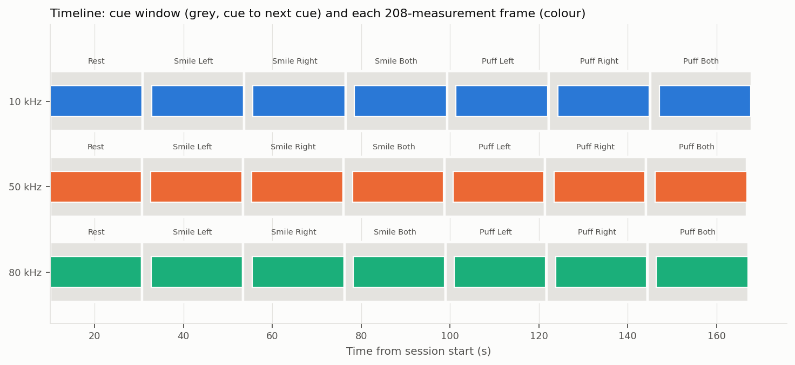

| | 10 kHz | 50 kHz | 80 kHz |
|---|---|---|---|
| Audit (7×208, không lỗi, CSV = meta sequence = pyEIT std, thời gian đơn điệu) | pass | pass | pass |
| Hz/amplitude không đổi (`configuration_checks.csv`, trước/sau mỗi trial), voltage mode | pass | pass | pass |
| Frame nằm trọn trong hold | 7/7 | 7/7 | 7/7 |
| Settle (cue → frame start) | 2.02 s | 2.02 s | 2.02 s |
| Frame / hold task (trung vị) | 20.64 / 22.85 s | 20.49 / 22.70 s | 20.56 / 22.74 s |
| Task cuối cách REST | 137.0 s | 136.2 s | 136.5 s |
| REST |V| trung vị; n ≥ 50; n ≥ 100 | 26.9; 73; 37 | 31.2; 82; 41 | 30.6; 73; 35 |
| Reciprocity error (pattern mạnh, trung vị) | **17.7%** | **12.3%** | **13.4%** |
| … sau khi fit gain cho từng cặp drive | 4.9% | 7.2% | 8.9% |
| `trial_windows.csv` | operator-reported | **thiếu** | **thiếu** |

**Đọc thế nào.** Hình timeline dùng thanh xám cho khoảng hold (từ cue tới cue kế tiếp) và thanh màu cho
frame duy nhất. Frame bắt đầu 2 s sau cue và kết thúc trước cue kế tiếp khoảng 0.05–0.27 s.

**Phát hiện mới: reciprocity.** Theo định lý reciprocity, đo (drive AB, sense MN) phải bằng đo
(drive MN, sense AB). Trong 208 pattern có 104 cặp như vậy; mình lấy 27–31 cặp mà cả hai phía đều
mạnh. Sai lệch trung vị 12–18% là **rất lớn**, lớn hơn chính hiệu ứng task.

Giả thuyết: board chạy ở voltage mode (`impedance_mode = False`), tức là áp điện thế kích thích chứ
không đo dòng. Dòng của mỗi cặp drive vì thế phụ thuộc contact impedance của 2 cup drive. Mô hình "mỗi
cặp drive một hệ số gain" có 16 gain với tổng cố định, tức tối đa 15 tham số tự do, cho 27–31 phương
trình. Một mô hình nhiều tham số như vậy tự nó đã giảm được một phần sai lệch, kể cả khi sai lệch chỉ là
nhiễu. Pipeline đo mức giảm "ăn may" đó bằng cách fit cùng mô hình lên nhiễu ngẫu nhiên có cùng cấu trúc
(`recip_fit_null_ratio_*` trong `qc_summary.csv`): với nhiễu, phần dư còn ~0.66–0.72 lần (5th percentile
0.48–0.54).

| | 10 kHz | 50 kHz | 80 kHz |
|---|---|---|---|
| Reciprocity trước → sau fit | 17.7% → 4.9% | 12.3% → 7.2% | 13.4% → 8.9% |
| Tỉ lệ sau/trước | **0.28** | 0.59 | 0.66 |
| 5th percentile của nhiễu thuần | 0.54 | 0.54 | 0.48 |
| Kết luận | ủng hộ giả thuyết dòng drive | chưa kết luận được | chưa kết luận được |

Gain ước lượng (`tables/qc_drive_gain.csv`): cặp drive **R1→L1** (ngang trán) có gain fit khoảng
**0.45–0.48× ở 50/80 kHz**, và R2→R1 khoảng 0.70× ở 10 kHz. Đây là **ước lượng từ fit, không phải dòng đo
được**, và con số của R1→L1 nằm đúng ở hai tần số mà fit chưa kết luận được. Dù vậy vẫn nên kiểm tra
contact của R1/L1/R2.

**Tại sao vẫn dùng được dz:** một gain cố định của mỗi kênh bị triệt tiêu trong `v_task / v_REST`.
Chỉ có **thay đổi** dòng drive giữa REST và task mới làm bẩn dz. Cột `dln_gain_vs_rest_pct_*` trong
bảng đó cho thấy thay đổi đó có trung vị 0.5% và 90% giá trị dưới 1.8%. Giá trị lớn nhất là 12%, và
thường rơi vào cặp R1→L1 (ước lượng này nhiễu).

**Không kết luận được:** timing chỉ xác nhận *acquisition*, không xác nhận bạn thực sự giữ đúng
tư thế trong cả 20.6 s.

> *For the professor:* "All three recordings pass the acquisition audit: 7 complete frames of 208
> patterns, constant settings, every frame inside its hold. However, reciprocal measurements differ by
> 12–18 %, consistent with unmeasured drive current in voltage mode; ratio-based features cancel
> fixed per-channel gains but not current changes between rest and task."

---

## 3. Baseline (REST)

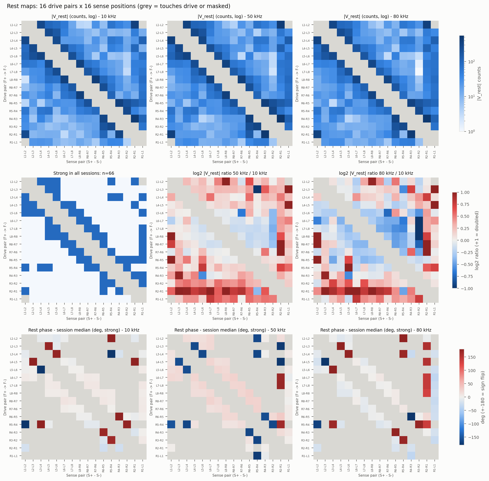

**Đọc thế nào.** Mỗi ma trận có hàng là cặp drive và cột là cặp sense, cả hai theo thứ tự vòng.
Ô xám là ô mà cặp sense chạm điện cực drive.
- Hàng 1: |v_REST| theo thang log. Gần đường chéo (sense nằm cạnh drive) thì mạnh, xa thì yếu. Đây
  là "U-shape" quen thuộc của adjacent protocol.
- Hàng 2: tỉ lệ log2 50k/10k và 80k/10k, cùng với mặt nạ 66 pattern mạnh ở **cả 3** phiên.
- Hàng 3: pha REST trừ trung vị phiên. Ô ±180° là pattern có cực tính ngược.

**Kết luận được:**
- Cấu trúc baseline gần như giống nhau ở 3 tần số, đúng như kỳ vọng vì cùng lần gắn.
- Các **hàng** R4-R3…R1-L1 nhạt hơn **cột** tương ứng. Đây là dạng bất đối xứng reciprocity ở mục 2:
  khi drive bằng các cup phía trên bên phải thì dòng thấp hơn.
- Tỉ lệ 50k/10k và 80k/10k thay đổi theo pattern (đỏ ở hàng R2-R1), tức là phụ thuộc tần số không
  đồng đều giữa các đường đo.

**Không kết luận được:** |v| không phải impedance của mô, vì chưa biết dòng và gain. Sự khác nhau
giữa tần số có thể do mô, do contact impedance hoặc do front-end của board. Thêm nữa, mỗi tần số là
một lần đo ở thời điểm khác nhau (phiên bắt đầu lúc 05:58, 06:20, 06:26 UTC).

---

## 4. Hiệu ứng task

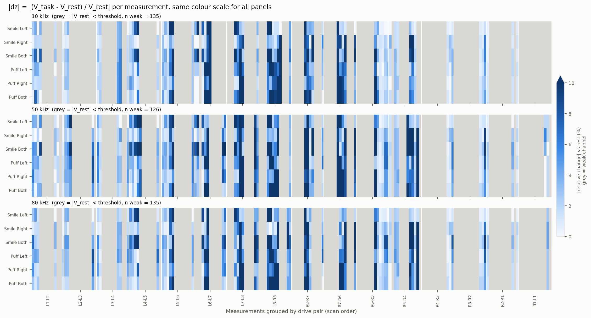

| Task | med \|dz\| % (≥50) 10/50/80k | med \|dz\| % (≥100) 10/50/80k | % pattern mạnh > 2% | n/208 có \|Δv\| > 8.7 count |
|---|---|---|---|---|
| SMILE_LEFT | 1.85 / 2.98 / 2.25 | 1.44 / 2.20 / 1.32 | 48 / 62 / 56 | 9 / 24 / 10 |
| SMILE_RIGHT | 1.83 / 3.05 / 2.38 | 1.20 / 1.99 / 1.77 | 48 / 67 / 62 | 11 / 22 / 11 |
| SMILE_BOTH | 3.65 / 5.05 / 4.46 | 2.95 / 4.50 / 3.61 | 78 / 79 / 84 | 28 / 46 / 30 |
| PUFF_LEFT | 3.08 / 3.84 / 4.52 | 2.10 / 3.77 / 3.00 | 67 / 73 / 77 | 12 / 21 / 15 |
| PUFF_RIGHT | 2.75 / 3.63 / 3.20 | 2.21 / 2.11 / 2.54 | 67 / 66 / 71 | 13 / 16 / 13 |
| PUFF_BOTH | 2.76 / 3.79 / 2.61 | 1.86 / 2.79 / 1.98 | 60 / 72 / 64 | 23 / 22 / 16 |

(Mức nền REST→REST đã đo ở phiên khác là 0.36–0.96% trên pattern ≥ 100 count. Hãy so với **cột
≥ 100**, không phải cột ≥ 50 mà handoff đã dùng.)

**Đọc heatmap.** Mỗi hàng là một task và mỗi cột là một pattern, sắp theo cặp drive theo thứ tự quét.
Xám là pattern yếu. Cả 3 panel dùng chung thang màu.

**Kết luận được:**
- Mọi task đều tạo thay đổi trên mức nền. Tính trên pattern ≥ 100, tỉ lệ so với cận trên của nền
  (0.96%) là 1.3–4.7 lần. Yếu nhất là SMILE_RIGHT ở 10 kHz (1.20%, chỉ hơn nền một chút); mạnh nhất
  là SMILE_BOTH.
- Thay đổi **tập trung** ở một số pattern cố định, chủ yếu khi drive là các cặp từ L4-L5 tới R6-R5 (vùng tai/TMJ/hàm/cằm),
  và cùng các pattern đó sáng lên ở cả 3 tần số.
- Chỉ 9–46 trên 208 pattern có |Δv| vượt 3× mức nhiễu tuyệt đối (8.7 count). Phần lớn tín hiệu
  nằm trong khoảng 1/5 số pattern.

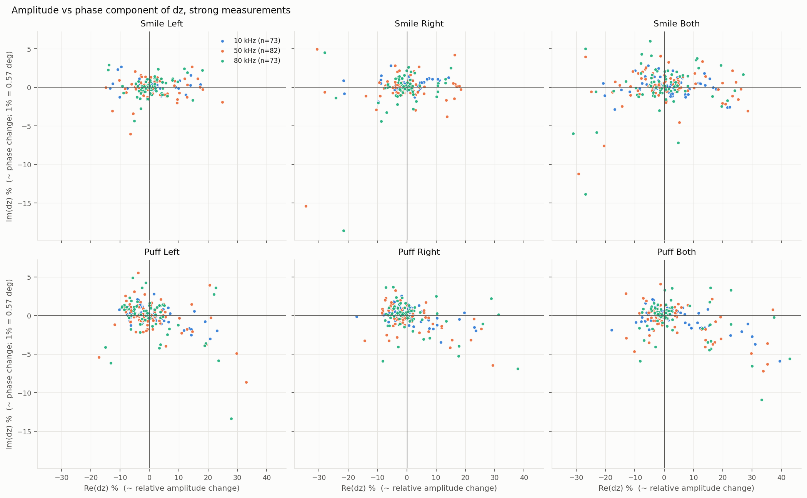

**Biên độ và pha (Re vs Im).** Các điểm trải theo chiều ngang (Re từ −30% tới +40%), còn chiều dọc phần lớn
nằm trong ±3%. Nghĩa là task làm **thay đổi biên độ là chính**; trung vị thay đổi pha ≤ 0.16°. Với
PUFF, Re trung vị thường âm: PUFF_LEFT từ −1.1 đến −1.6%, PUFF_RIGHT từ −0.3 đến −1.5%, PUFF_BOTH
từ +0.2 đến −1.2%. Nhiều đường đo **giảm** biên độ khi phồng má. Hướng thay
đổi của mỗi pattern có cả dương lẫn âm, nên **không có "một con số" cho mỗi task**.

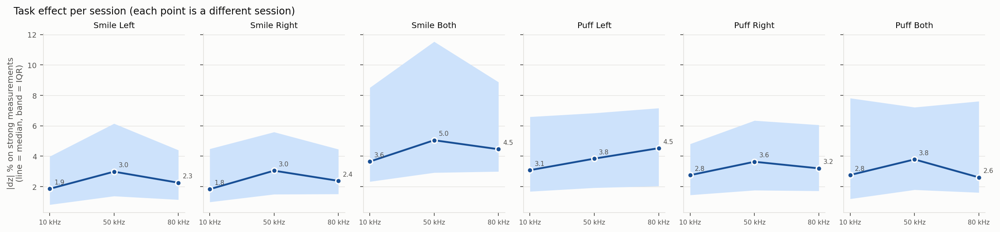

**Theo tần số.** Với hầu hết task, 50 kHz cho trung vị cao nhất. 50 kHz cũng có nhiều pattern
mạnh nhất (82) và reciprocity error thấp nhất (12.3%).

**Không kết luận được từ hình này:** rằng "50 kHz nhạy hơn với cơ". Mỗi điểm là một phiên khác nhau, đo
ở thời điểm khác, và mỗi task chỉ có 1 frame. Biến thiên giữa phiên ở cùng tần số thì **chưa đo**,
nên không tách được ảnh hưởng tần số khỏi sự khác nhau giữa các lần thực hiện task.

> *For the professor:* "Every task changes the strong patterns by more than the rest-to-rest
> baseline measured earlier (median 1.2–4.5 % vs 0.36–0.96 % on patterns ≥ 100 counts). The change
> is mostly in amplitude, not phase, and is concentrated in a fixed subset of jaw/chin patterns. The
> apparent frequency trend is confounded with session, because each frequency is a different,
> single-frame recording."

---

## 5. Lateralization

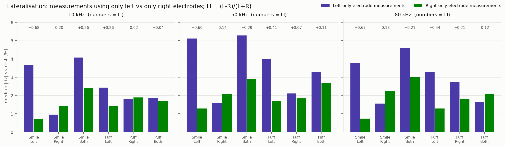

**Đọc thế nào.** Thanh tím là trung vị |dz| của các pattern mạnh chỉ dùng cup bên trái (16–22
pattern); thanh xanh là pattern chỉ dùng cup bên phải. LI = (L − R)/(L + R). Bảng `tables/lateralization.csv` có thêm phép so
**từng cặp đối xứng gương** (pattern L và pattern R tương ứng), cho kết quả chắc chắn hơn so sánh
hai trung vị:

| Task | LI 10/50/80k | Cặp gương có L > R |
|---|---|---|
| SMILE_LEFT | +0.68 / +0.60 / +0.67 | 15/16, 16/17, 16/16 |
| SMILE_RIGHT | −0.20 / −0.14 / −0.18 | 6/16, 4/17, 4/16 |
| PUFF_LEFT | +0.26 / +0.41 / +0.44 | 14/16, 13/17, 11/16 |
| PUFF_RIGHT | −0.02 / +0.07 / +0.21 | 10/16, 10/17, 8/16 |
| SMILE_BOTH | +0.26 / +0.29 / +0.21 | 12/16, 11/17, 8/16 |
| PUFF_BOTH | +0.04 / +0.11 / −0.12 | 8/16, 10/17, 5/16 |

**Kết luận được:** SMILE_LEFT lệch trái rất rõ và lặp lại; SMILE_RIGHT lệch phải nhưng yếu hơn
nhiều; PUFF_LEFT lệch trái. **PUFF_RIGHT không cho lệch phải** ở chỉ số này.

**Không kết luận được, và có confound quan trọng:**
- **Thời điểm đo trong frame trùng với phía trái/phải.** Các pattern chỉ-L được đo trung bình
  4.1 s sau khi frame bắt đầu, còn pattern chỉ-R là 15.2 s. Nếu cử động nhạt dần trong 22 s giữ (mỏi,
  hoặc má xẹp dần), pattern trái sẽ trông "mạnh hơn" với *bất kỳ* task nào. Việc SMILE_RIGHT vẫn ra
  LI âm cho thấy timing không giải thích được tất cả, nhưng nó có thể đã làm phía phải yếu đi.
- Số pattern mạnh không cân bằng (L 18–22 so với R 16–17), tức là contact/hình học giữa hai bên
  vốn đã không đối xứng.
- Chỉ số này rất nhạy với cách chọn pattern. Nếu lấy cả pattern yếu, SMILE_RIGHT ra −6.96 điểm %
  thay vì −0.47. Chỉ 60/208 pattern là "chỉ L" hoặc "chỉ R"; phần lớn thông tin của PUFF nằm ở
  pattern băng qua cằm (L8–R8). Xem mục 9: ảnh tái tạo dùng cả 208 pattern và cho PUFF_RIGHT lệch phải.

> *For the professor:* "Left-cued tasks lateralise clearly to left-only electrode patterns
> (LI ≈ +0.6 for SMILE_LEFT, 15–16 of 16–17 mirror pairs), right-cued tasks only weakly. A caveat is
> that left-only patterns are acquired about 11 s earlier in each 20.6 s scan than right-only ones,
> so lateralisation is partially confounded with within-scan timing."

---

## 6. Độ lặp lại và đặc thù task

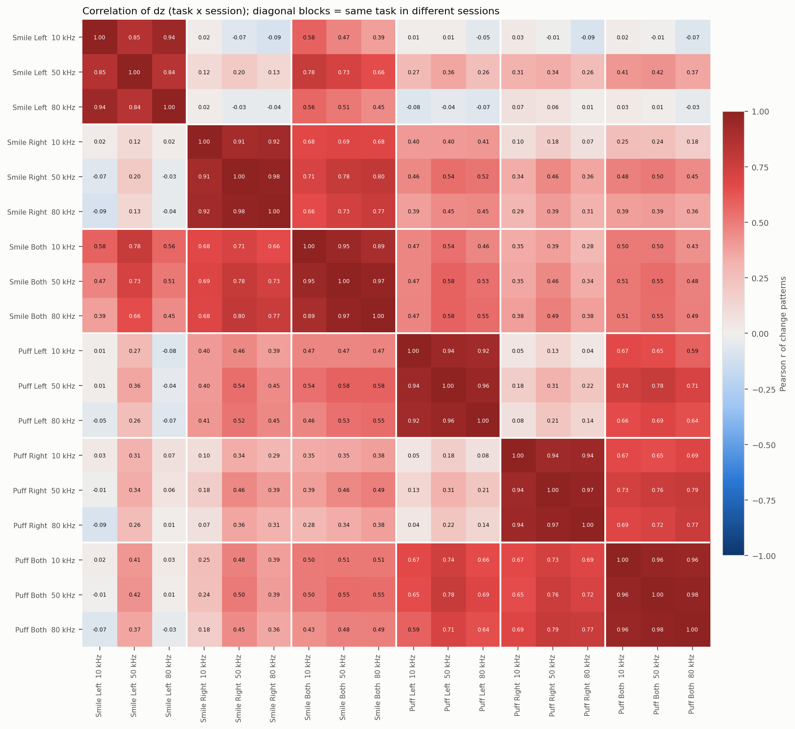

**Đọc thế nào.** Mỗi ô là tương quan Pearson giữa hai vector dz (Re và Im ghép lại) trên 66 pattern
mạnh ở cả 3 phiên. Các khối 3×3 trên đường chéo là cùng một task ở 10/50/80 kHz.

**Kết luận được:**
- Cùng task, khác tần số: **r = 0.84–0.98**. Khác task, khác tần số: trung bình 0.02–0.58, cao nhất
  0.80 (`tables/correlation_across_sessions.csv`).
- Trong cùng phiên, **SMILE_LEFT~SMILE_RIGHT có r = 0.02 / 0.20 / −0.04** và PUFF_LEFT~PUFF_RIGHT
  có r = 0.05 / 0.31 / 0.14 (`figures/correlation_within_session.png`), dù hai task chỉ cách nhau 23 s. Nếu thay đổi chủ yếu là drift
  chung theo thời gian thì hai frame liền nhau phải giống nhau. Kết quả này là **bằng chứng mạnh
  nhất chống lại giả thuyết "chỉ là drift"**.
- **Tính cộng tính** (`tables/additivity.csv`): BOTH ≈ a·LEFT + b·RIGHT với a = 0.74–1.02, b = 0.79–1.13, R² = 0.77–0.95.
  Thay đổi khi làm hai bên gần bằng tổng thay đổi hai bên làm riêng. Điều này hợp lý về vật lý
  nếu thay đổi khu trú ở mỗi bên mặt.

**Không kết luận được:**
- Ba phiên **không** phải lặp lại thuần túy: tần số khác nhau, thứ tự task giống hệt, cùng lần gắn
  cup. Một phần tương quan cao có thể do "task ở vị trí thứ k luôn cách REST k × 23 s".
- Tương quan chỉ cao trên 66 pattern mạnh. Với cả 208 pattern, r cùng task giảm còn 0.30–0.90.
- Handoff ghi "smile vs puff ≈ −0.2…0.27". Với định nghĩa của mình, SMILE_BOTH tương quan với
  PUFF ở mức 0.35–0.58, nên đừng dùng câu đó làm luận điểm. Luận điểm SMILE_LEFT~SMILE_RIGHT ≈ 0
  thì vững hơn.
- Mọi task trong một phiên dùng chung một mẫu REST. Nhiễu của frame REST đó vì thế đi vào tất cả dz
  của phiên, khiến tương quan giữa các task *trong* phiên bị đẩy lên (nhưng không ảnh hưởng tương
  quan *giữa* các phiên).

> *For the professor:* "Same-task change patterns correlate at r = 0.84–0.98 across the three
> sessions, while different tasks correlate at 0.02–0.58. Left and right smiles recorded 23 s apart
> are uncorrelated (r ≈ 0.0–0.2), which argues against a common slow drift, and the bilateral task is
> well explained by the sum of the two unilateral ones (R² = 0.77–0.95)."

---

## 7. "Electrode involvement" (heuristic)

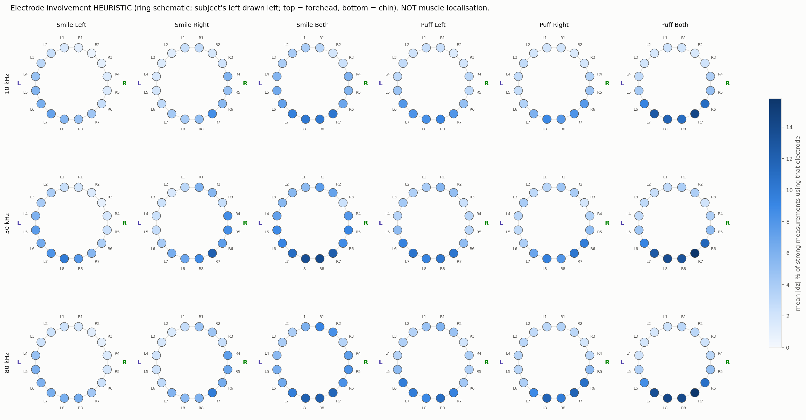

**Đọc thế nào.** Màu của mỗi cup là trung bình |dz| của các pattern mạnh có dùng cup đó ở bất kỳ vai
trò nào (F+, F−, S+, S−), vẽ trên sơ đồ vòng (không theo tỉ lệ).

**Kết luận được:** các cup hàm/cằm (L6–L8, R6–R8) tham gia nhiều nhất ở mọi task. Với task một bên,
màu đậm dịch về đúng phía (SMILE_LEFT: L4–L7; SMILE_RIGHT: R4–R7).

**KHÔNG phải định vị cơ.** Mỗi pattern dùng 4 cup, và độ nhạy của nó trải rộng giữa 4 cup đó. Một
cup "đậm" có thể do contact/chuyển động của chính cup đó, do da bị kéo khi cười, hoặc do vị trí nó
nằm trong nhiều đường đo nhạy. Pattern yếu đã bị loại, nên cup nào có ít pattern mạnh sẽ bị đánh giá
thấp.

---

## 8. Nhận dạng task thử nghiệm

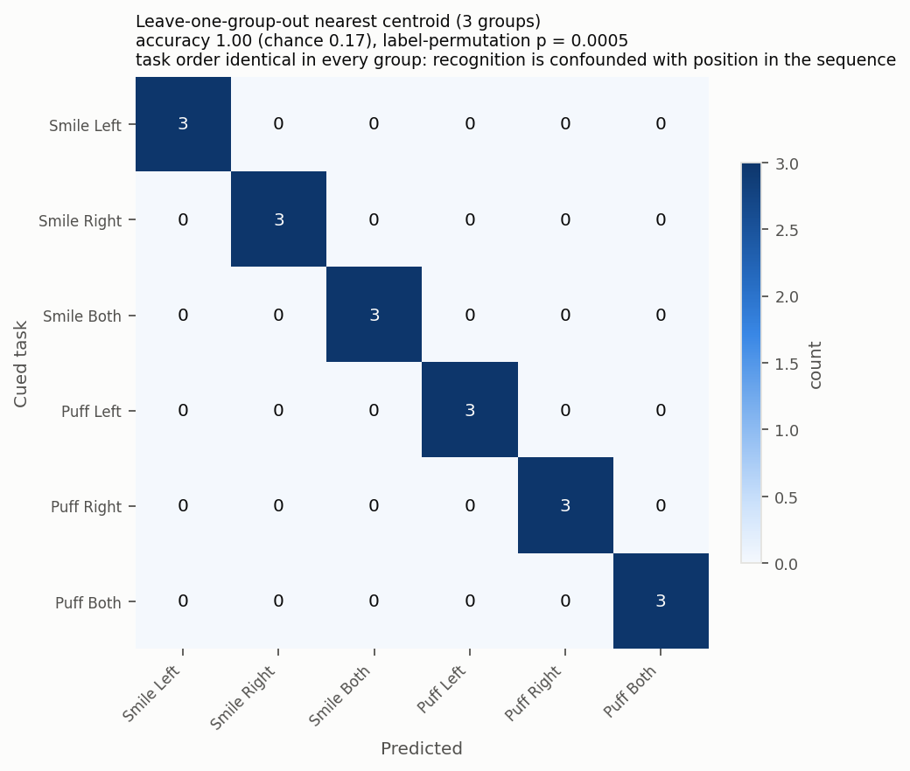

**Cách làm.** Coi 3 phiên như 3 lần lặp. Mỗi lần giữ lại một phiên làm test; centroid của mỗi task
là trung bình dz của 2 phiên còn lại; mỗi frame test được gán vào centroid có tương quan cao nhất.
Kết quả: **18/18 đúng** (chance 1/6). Permutation test xáo nhãn trong các phiên train cho
**p ≈ 0.0005**, mức thấp nhất có thể với 2000 lần xáo.

**Cảnh báo, phải nói cùng lúc với con số 18/18:**
- Chỉ có 18 frame, 1 người, 1 lần gắn, 3 "lần lặp" thực ra là 3 tần số.
- **Thứ tự task giống nhau ở cả 3 phiên.** Một bộ phân loại chỉ cần biết "frame thứ mấy sau REST"
  cũng đạt 100%. Vì task và vị trí trong chuỗi trùng hoàn toàn, phép thử này không tách được hai thứ này. Mục 6
  (L~R ≈ 0 dù liền kề) cho thấy nhiều khả năng bộ phân loại không chỉ dựa vào vị trí, nhưng chưa
  chứng minh được.
- Đây không phải ước lượng độ chính xác cho người khác, phiên khác, hay sau khi gắn lại cup.

> *For the professor:* "As a feasibility check only, leave-one-session-out nearest-centroid
> classification labels all 18 frames correctly. Because task order was identical in every session and
> there is one subject and one electrode mount, this does not estimate real-world recognition accuracy."

---

## 9. Image reconstruction — có dùng được không?

### 9.1 Về kỹ thuật: có

- Sequence khớp 208/208 với `pyeit.eit.protocol.create(16, dist_exc=1, step_meas=1, parser_meas="std")`
  với A=F+, B=F−, M=S+, N=S− (logical ring L1..L8, R8..R1).
- Dùng **time-difference** với REST làm mốc. Dữ liệu đưa vào là `y = Re(dz)` của các kênh mạnh, được
  "ghép" lên điện áp mô phỏng của chính mô hình (`v1 = v0_sim · (1 + y)`), nên gain, pha và cực tính
  của từng kênh tự triệt tiêu. Đây là cách hợp lý khi count chưa hiệu chuẩn và cực tính chưa được kiểm
  chứng bằng known load.
- Pipeline dùng đúng các ma trận do pyEIT tạo ra, với cùng setting như `scripts/eit_sim_playground.py`
  (BP weight none; JAC kotre, p = 0.5, λ = 0.01; GREIT p = 0.5, λ = 0.01, n = 32). Nó chỉ bỏ các hàng
  ứng với kênh yếu (< 50 count). Khi giữ đủ 208 hàng, kết quả khớp `solver.solve()` gốc của pyEIT;
  pipeline tự kiểm tra điều này mỗi lần chạy.
- Lưu ý khi tự dùng pyEIT: `solve(v1, v0, normalize=True)` chia cho `|v0|` và giữ nguyên dấu của v0,
  nên nếu cực tính của board khác mô hình thì hàng đó bị đảo dấu; `compute_jac` trả về −dV/dσ.

### 9.2 Kết quả exploratory: BP, JAC, GREIT ở 3 tần số

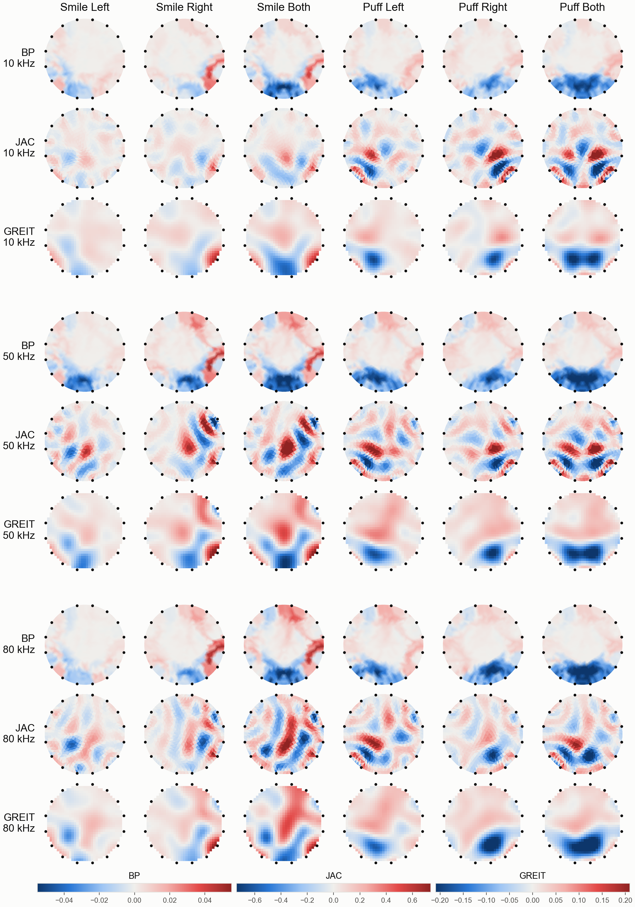

**Đọc thế nào.** Mỗi đĩa là "bề mặt mặt" được ép phẳng thành hình tròn: trán ở trên (L1, R1), cằm ở
dưới (L8, R8), **bên trái của người đo vẽ bên trái**. Trong mỗi tần số, ba hàng là BP, JAC, GREIT; cột là
6 task. Mỗi thuật toán có một thang màu chung cho cả 3 tần số. Màu xanh nghĩa là *kém dẫn điện hơn lúc
REST*, màu đỏ là *dẫn điện tốt hơn lúc REST*, theo mô hình 2D; đơn vị tùy ý. Dữ liệu thô của mỗi task có
cả hai chiều: 34–51% số kênh mạnh tăng biên độ, phần còn lại giảm. Màu là cách inverse model giải thích
chúng, không phải phép đo trực tiếp.

| (mốc = REST; `tables/recon_metrics.csv`) | BP | JAC | GREIT |
|---|---|---|---|
| Năng lượng nửa trái: task LEFT / RIGHT | 0.67–0.84 / 0.08–0.26 | 0.66–0.85 / 0.11–0.24 | 0.70–0.94 / 0.07–0.19 |
| Lệch đúng phía (4 task một bên × 3 tần số) | 12/12 | 12/12 | 12/12 |
| Năng lượng ở nửa dưới (hàm/cằm) | 0.78–0.98 | 0.42–0.91 | 0.59–0.95 |
| Image/noise | 3.2–11.8 | 0.9–3.8 | 1.5–5.2 |
| Tương quan ảnh giữa tần số (trung vị) | 0.95 | 0.63 | 0.85 |

Tương quan giữa các thuật toán (cùng task, cùng tần số; `tables/recon_image_corr_between_algorithms.csv`):
BP~GREIT trung vị 0.68, JAC~GREIT 0.62, BP~JAC 0.33.

**Kết luận được:**
- **Bền vững** là những gì cả 3 thuật toán đồng ý: phía trái/phải (36/36, kể cả PUFF_RIGHT, task mà chỉ
  số L-only/R-only ở mục 5 không bắt được), thay đổi dồn về nửa dưới (hàm/cằm), và task hai bên trải ra
  hai phía.
- Ảnh của cùng thuật toán giống nhau giữa các tần số.
- Có thể dùng ảnh như một cách **nén 208 kênh thành đặc trưng không gian thô** (trái/phải, trên/dưới).

**Không kết luận được:** vị trí và hình dạng chính xác của đốm, các đốm ở giữa đĩa, dấu đỏ/xanh. Những
chi tiết này phụ thuộc thuật toán (tương quan giữa thuật toán chỉ 0.3–0.7). BP có image/noise cao nhất vì
nó làm mờ mạnh, không phải vì có nhiều thông tin hơn. **Xanh ở cằm không chỉ có ở PUFF:** tỉ lệ màu xanh
ở nửa dưới (BP, GREIT) là 0.77–1.00 với PUFF, nhưng cũng 0.59–0.96 với SMILE_LEFT và SMILE_BOTH, dù smile
không có không khí. "Không khí trong má" là giả thuyết hợp lý cho PUFF nhưng chưa được chứng minh.

> *For the professor:* "BP, JAC and GREIT, run with identical inputs and pyEIT settings, agree on the
> coarse structure, namely the cued side in 36 of 36 unilateral cases and a jaw/chin-dominated change,
> but agree only moderately on details (inter-algorithm r ≈ 0.3–0.7). We therefore report only the
> algorithm-independent features."

### 9.3 Tại sao KHÔNG được gọi đây là ảnh mặt/cơ

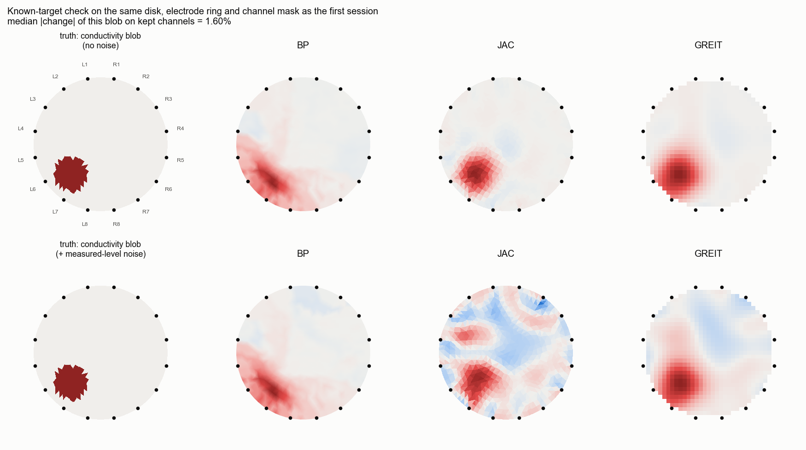

1. **Sai mô hình hình học.** Mô hình là đĩa 2D có 16 điện cực cách đều nhau. Thực tế các cup nằm trên
   bề mặt 3D, dòng đi xuyên qua đầu, và đường vòng còn **zig-zag quanh tai** (L3 trước tai → L4 sau tai
   → L5 TMJ, lại ở trước tai). Độ khớp giữa |V_REST| đo được và mô hình đồng nhất chỉ là Spearman
   ρ = 0.65–0.67 (`tables/recon_disk_model_fit.csv`).
2. **Độ lớn không khớp với "thay đổi độ dẫn mô".** Ở hình trên, một khối **+50%** độ dẫn (bán kính 1/4
   đĩa) chỉ tạo **1.6%** thay đổi trung vị trên các kênh mạnh, trong khi task thật tạo 1.8–5.1%. Đây là
   một mô phỏng duy nhất (một vị trí, một kích thước) trên mô hình chỉ khớp REST ở mức ρ ≈ 0.66, nên chỉ
   là gợi ý. Các nguồn có khả năng gây ra thay đổi lớn như vậy là biến dạng da, cup bị kéo và contact
   impedance thay đổi. Mô hình không phân biệt được những thứ này với độ dẫn, nên nó vẽ chúng thành đốm màu, thường
   thành **cặp đỏ/xanh xen kẽ** như trong ảnh JAC. Đó là dấu hiệu điển hình của model error. Hình trên
   cũng cho thấy tính cách từng thuật toán khi mô hình *đúng*: BP đẩy đốm ra sát mép, JAC đặt đúng chỗ
   nhưng bị nhiễu làm vỡ, GREIT đúng chỗ và ổn định nhất.
3. **Dòng không được đo** (voltage mode, reciprocity error 12–18%).
4. **Mỗi state chỉ có 1 frame, quét tuần tự 20.6 s.** Các kênh được đo ở những thời điểm khác nhau trong
   lúc giữ cử động, trong khi inverse giả định cả 208 kênh là một "ảnh chụp" tức thời.
5. **Chưa có validation**: chưa có resistor network hay phantom với vật đã biết vị trí, chưa kiểm cực
   tính bằng known load. λ và p là lựa chọn tùy ý; ảnh sẽ thay đổi khi đổi chúng.

> *For the professor:* "The board's sequence is exactly pyEIT's 16-electrode adjacent 'std' protocol,
> so a normalised time-difference reconstruction is technically possible, and BP, JAC and GREIT all
> lateralise to the cued side. However, in the same 2-D disk model a +50 % conductivity inclusion is
> needed to produce the measured size of change, which suggests that skin/electrode movement and contact
> effects contribute substantially. The disk geometry is not the face, current is not measured, and
> nothing has been phantom-validated, so these are exploratory projections, not anatomical images."

### 9.4 Muốn có ảnh bảo vệ được thì cần gì

1. **Kiểm chứng trên resistor network rồi tới phantom** (gel/saline có vật đã biết vị trí) với chính
   board, cáp và cup này: cực tính, reciprocity, mức nhiễu (xem
   [capture-and-reconstruction-gates](../cn0565-capture-and-reconstruction-gates.md)).
2. **Đo dòng**: chạy `impedance_mode` hoặc thêm phép đo dòng drive, để reciprocity error giảm xuống
   mức vài %.
3. **Mô hình 3D có tọa độ cup thật** (photogrammetry hoặc đo landmark), với mesh đầu/mặt (EIDORS/Netgen
   hoặc pyEIT 3D) và complete electrode model (xem
   [facial-environment-and-forward-models](../facial-environment-and-forward-models.md)).
4. **Noise covariance thật** từ nhiều frame REST trong cùng phiên, thay cho giả định 2 count.
5. Ngay cả khi đó, một ảnh "đẹp" vẫn chưa chứng minh định vị cơ nếu chưa có EMG/video và chưa kiểm tra
   đặc hiệu.

**Khuyến nghị thực tế:** cho paper đầu tiên (task recognition, unobtrusive), dùng **dz trên các kênh
mạnh** làm feature chính. Ảnh có thể đưa vào như một hình minh họa exploratory hoặc một feature bổ sung
(ví dụ tỉ lệ năng lượng trái/phải), có dán nhãn rõ ràng.

---

## 10. Giới hạn bắt buộc phải nói

- **Một REST duy nhất ở đầu phiên**, không có REST giữa các task. Vì vậy không tách được drift (task
  cuối đo sau REST khoảng 137 s), carryover giữa các task liền nhau, hay recovery.
- **Thứ tự task giống nhau ở cả 3 phiên.** Tương quan cao giữa phiên có thể một phần do cùng thứ
  tự/drift. SMILE_LEFT~SMILE_RIGHT ≈ 0 phản bác "drift chung đơn thuần" nhưng chưa loại trừ hẳn.
- 3 phiên khác tần số nên **không phải lặp lại thuần**. Mỗi task có 1 frame mỗi phiên; 1 người,
  1 lần gắn cup.
- **Phía trái được quét trước phía phải** trong mỗi frame (khoảng 11 s chênh lệch), nên
  lateralization bị confound với thời gian trong frame.
- Count **chưa hiệu chuẩn**, so sánh % chỉ có nghĩa trong cùng phiên. **Voltage mode không đo dòng**,
  reciprocity error 12–18%. Mức nền 0.36–0.96% lấy từ một phiên khác (10 kHz, amplitude 800).
- **Pattern ID là cấu hình 4 điện cực, không phải pixel.** Không có video/EMG xác nhận cử động. Kết
  quả không phải % hoạt hóa cơ, cũng không phải tín hiệu của một cơ riêng lẻ.
- Amplitude 600 là giá trị **lệnh** (DacVoltPP/800 × 2047). Biên độ và dòng thật chưa được đo.
- Phiên 2 và 3 **chưa có `trial_windows.csv`**, nên label chỉ là `cue_assumed`.

---

## 11. Đề xuất phiên tiếp theo

Mục tiêu là gỡ từng confound ở trên, với một thay đổi cho mỗi yếu tố:

| Vấn đề | Thiết kế đề xuất |
|---|---|
| Drift, carryover | Mỗi task theo dạng **REST → TASK → REST** (chế độ gốc của notebook); REST sau dùng làm REST trước của task kế tiếp |
| Thứ tự trùng task | **Thứ tự ngẫu nhiên** trong mỗi vòng, ≥ 2 vòng (tốt nhất 3), seed ghi vào meta |
| Lẫn tần số với phiên | **Một tần số cố định** cho cả phiên. Gợi ý 50 kHz vì có nhiều pattern mạnh nhất và reciprocity tốt nhất (12.3%); đây là lý do thực tế, chưa phải bằng chứng sinh lý |
| Không có mức nền trong phiên | **REST-only control** (REST → REST → REST) xen vào mỗi vòng, cùng cue/timing; thêm ≥ 3 frame REST liên tiếp ở đầu phiên để ước lượng nhiễu từng pattern |
| Lateralization trùng thời điểm quét | Nếu phần mềm cho phép: **đảo thứ tự cặp drive** (bắt đầu từ R) ở một nửa số trial. Phải version hóa protocol |
| Không xác nhận cử động | **Video** quay mặt có frame counter/cue trên màn hình; tùy chọn EMG |
| Contact | Kiểm contact của **R1, L1, R2** trước khi đo (gain fit của R1→L1 ~0.45–0.48× ở 50/80 kHz, ước lượng) |
| 22 s giữ PUFF gây mỏi | Cân nhắc protocol rút gọn chỉ gồm các pattern mạnh (73–82 pattern, khoảng 8 s/frame). Collector hiện từ chối sequence khác 208, nên cần sửa và version hóa cùng inverse |

Ước lượng thời gian: một vòng gồm 6 task + 7 REST + 2 REST-only khoảng **15 frame × 22.8 s ≈ 5.7
phút**; 3 vòng khoảng 17 phút. Không đề xuất tăng amplitude: mọi thay đổi về dòng/điện áp cần review
an toàn riêng.

> *For the professor:* "Next session: one fixed frequency, rest–task–rest for every task, randomised
> order over at least two rounds, interleaved rest-only controls, several initial rest frames for a
> per-pattern noise estimate, and synchronised video. This removes the drift, order and frequency
> confounds of the present pilot."

---

## 12. Khác biệt so với handoff và việc còn treo

- `scripts/cn0565_pilot.py`, `docs/cn0565-pilot-gui-and-data-guide.md` và
  `docs/protocols/user-p1-wiring-interleaved-208.json` **không có trong repo này** (chúng nằm trên máy
  Windows). Pipeline `app.eit` tự tính lại mọi đặc trưng và đọc mapping từ `meta.json`. Các tên
  `analyze_recording` / `interpret_features` / `export_analysis` chưa được dùng.
- 3 thư mục phiên nay nằm ở `eit-measurement/data/sessions/`, đúng quy ước của handoff.
- Các con số trong handoff đều **tái lập được**: REST, % trung vị, lateralization, tương quan 0.84–0.98
  (handoff ghi 0.83). Riêng nhận định "smile vs puff ≈ 0" thì không vững với định nghĩa ở đây
  (xem mục 6).
- **Câu hỏi còn mở:** phiên 2 và 3 bạn có làm đúng cue suốt mỗi phase như phiên 1 không? Nếu có, có
  thể tạo `trial_windows.csv` (provenance `operator_reported_cue_following`, cùng định dạng phiên 1).
